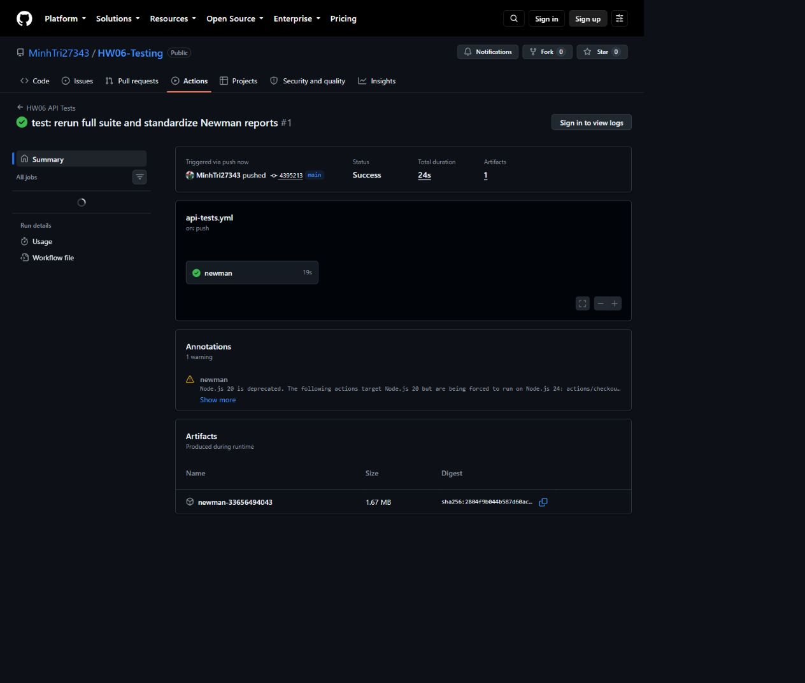
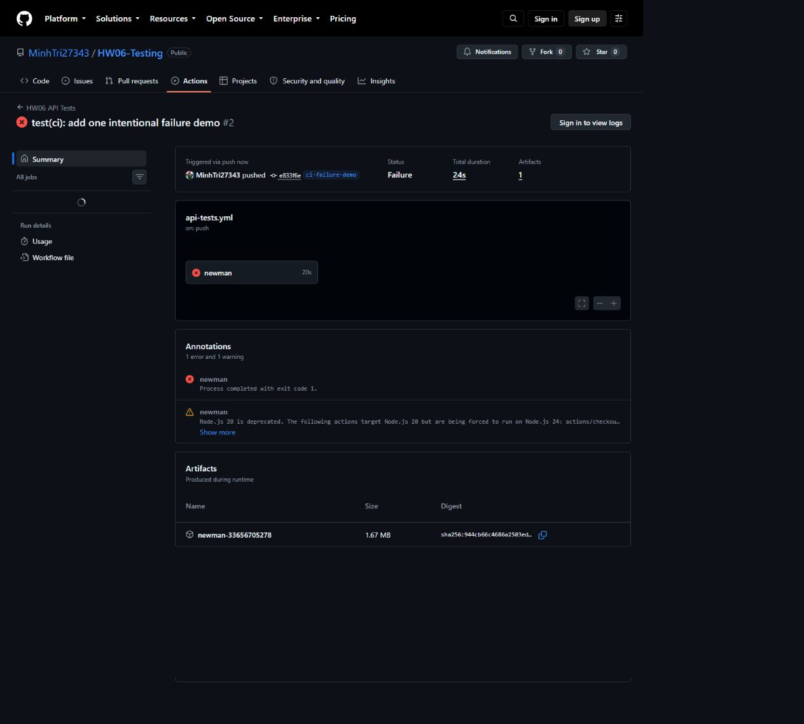

# Báo cáo HW06 - API Testing

## 1. Thông tin

- MSSV: `23127502`
- SUT: EShop tại `http://127.0.0.1:3000`
- Feature: FR-03, FR-09, FR-17
- Ngày thực thi: 2026-09-02
- Nguồn chuẩn: `api_specification.md`, [SRS chính thức EShop](https://github.com/ttbhanh/eshop-sut) và đề HW06.

Không sửa mã nguồn SUT. Expected result luôn dựa vào đặc tả; failure do sai khác của SUT được giữ nguyên.

## 2. Phạm vi endpoint

| Feature | Endpoint chính | Mục tiêu |
|---|---|---|
| FR-03 | `POST /api/forgot-password`, `POST /api/reset-password` | OTP 6 số, email binding, expiry, single-use, password policy |
| FR-09 | `POST /api/apply-coupon`, `POST /api/coupon-usage` | C1-C5, boundary, công thức giảm, usage và identity |
| FR-17 | `GET /api/coupons`, `POST /api/admin/coupons`, `DELETE /api/admin/coupons/:id` | Admin authorization và validation coupon |

Các yêu cầu bảo mật chính: SEC-01, SEC-02, SEC-03, SEC-05 và SEC-07.

## 3. Quy trình AI và kiểm toán

AI sinh 35 candidate cho mỗi FR. Người kiểm thử rà soát từng candidate theo SRS, gắn nhãn và giữ audit trail trước khi bổ sung 5 ca riêng.

| FR | AI | VALID | INVALID | INCOMPLETE | Human-added | Final |
|---|---:|---:|---:|---:|---:|---:|
| FR-03 | 35 | 27 | 3 | 5 | 5 | 40 |
| FR-09 | 35 | 27 | 3 | 5 | 5 | 40 |
| FR-17 | 35 | 27 | 3 | 5 | 5 | 40 |
| **Tổng** | **105** | **81** | **9** | **15** | **15** | **120** |

`INVALID` và `INCOMPLETE` không bị xóa. Trường `auditReason` giải thích sai sót; trường `correction` ghi oracle đã sửa. Các ca human-added tập trung vào brute-force/concurrency, danh tính JWT, time boundary, Unicode confusable, mass assignment và referential integrity.

## 4. Thiết kế kiểm thử

### 4.1 FR-03

- Phân hoạch email: hợp lệ, chưa đăng ký, rỗng, null, thiếu trường, sai định dạng, whitespace và object.
- OTP: đúng/sai, độ dài 5/6/7, chữ, whitespace, email khác, dùng lại, hai OTP liên tiếp và brute-force.
- Mật khẩu: biên 7/8 ký tự, thiếu chữ hoa/thường/số/ký tự đặc biệt, null.
- Schema/security: không lộ trường password, parameterized query, SEC-01 và SEC-07.

### 4.2 FR-09

- C1-C5: code tồn tại/active, expiry, ngưỡng đơn, JWT và usage limit.
- Boundary: dưới/bằng/trên `min_order_amount` cho SAVE10 và BIGBUY.
- Công thức: percent và fixed; final amount không âm.
- Security: thiếu/sai JWT, giả mạo `user_id`, SQL injection và concurrent usage.
- Schema: kiểu `success`, `coupon_id`, `discount_amount`, `final_amount`, `message`.

### 4.3 FR-17

- GET/POST/DELETE với admin, user, thiếu token và token sai.
- `code`: bắt buộc, rỗng, whitespace, unique, SQL/XSS và Unicode confusable.
- `type`, `discount_value`, `min_order_amount`, `expired_at`, `max_uses_per_user`: valid/invalid/type/boundary.
- Xóa coupon: tồn tại, không tồn tại, ID sai định dạng, user thường và coupon có usage.

## 5. Postman và Newman

Collection-level pre-request script thực hiện:

```javascript
pm.request.headers.upsert({ key: "X-Student-Id", value: "23127502" });
console.log("X-Student-Id: 23127502", pm.info.requestName);
```

Collection có setup login lấy admin/user JWT vào collection variables; các ca stateful dùng `pm.sendRequest` để cấp OTP, dùng lại OTP, ghi usage hoặc tạo coupon trước khi xóa. Environment giữ `baseUrl`; data file FR-09 chạy 8 boundary rows.

Các tính năng đã dùng: collection, folder, environment, collection variables, pre-request script, test script, data-driven run, dynamic setup, Newman CLI, JSON reporter, HTML Extra reporter và GitHub Actions. Không khai báo monitor/mock server vì chưa có bằng chứng sử dụng thật.

## 6. Kết quả thực thi

| FR | Test cases | Passed | Failed | Pass rate | Nhóm bug |
|---|---:|---:|---:|---:|---:|
| FR-03 | 40 | 22 | 18 | 55.0% | 4 |
| FR-09 | 40 | 29 | 11 | 72.5% | 4 |
| FR-17 | 40 | 17 | 23 | 42.5% | 4 |
| **Tổng** | **120** | **68** | **52** | **56.7%** | **12** |

Full run thực hiện 418 assertions, trong đó 93 assertion failed. Các suite riêng tạo kết quả tương ứng: FR-03 có 24 assertion failures, FR-09 có 25 và FR-17 có 44. Smoke suite có 3 requests và 6/6 assertions pass. Data-driven suite phát hiện hai lỗi tại ranh giới `total_amount == min_order_amount`.

Hai ca đang mang `bugId = REVIEW` không được tính là bug vì SRS chưa quy định rõ cách chuẩn hóa whitespace code và hành vi xóa coupon đã có usage.

## 7. Bug đã xác nhận

| ID | Severity | Mô tả |
|---|---|---|
| BUG-FR03-01 | High | OTP chỉ có 4 chữ số thay vì tối thiểu 6 |
| BUG-FR03-02 | Medium | Forgot-password không validation định dạng email |
| BUG-FR03-03 | High | Reset-password chấp nhận mật khẩu yếu/null |
| BUG-FR03-04 | High | Không rate-limit thử OTP sai |
| BUG-FR09-01 | Critical | Công thức percent sai |
| BUG-FR09-02 | High | Biên `total == min` bị từ chối |
| BUG-FR09-03 | Critical | Apply-coupon không yêu cầu JWT |
| BUG-FR09-04 | High | Không validation kiểu `total_amount`/`user_id` |
| BUG-FR17-01 | Critical | API quản lý coupon không kiểm tra role Admin |
| BUG-FR17-02 | High | Thiếu validation trường coupon |
| BUG-FR17-03 | Medium | Duplicate code trả 500 thay vì lỗi kiểm soát |
| BUG-FR17-04 | Medium | Xóa ID sai/không tồn tại vẫn báo thành công |

Toàn bộ 12 bug được trình bày trong `reports/bug-report.md`; mỗi bug có link GitHub Issue, ảnh trang Issue và ảnh evidence chụp trực tiếp từ Newman HTML report trong `reports/bug-evidence/`. Danh sách công khai: [GitHub Issues](https://github.com/MinhTri27343/HW06-Testing/issues). Không sử dụng các file issue rời.

## 8. CI/CD

Workflow `.github/workflows/api-tests.yml` cài dependencies, khởi động SUT, chờ readiness, chạy suite được chọn và upload Newman evidence. Push lên `main` mặc định chạy smoke suite. `workflow_dispatch` cho phép chọn `smoke`, `full` hoặc `data`.

Hai run thực tế đã được thực hiện ngày 2026-09-02:

- [`main` — Actions #1 Success, commit `4395213`](https://github.com/MinhTri27343/HW06-Testing/actions/runs/33656494043): 3 requests, 6 assertions, 0 failures.
- [`ci-failure-demo` — Actions #2 Failure, commit `e833f6e`](https://github.com/MinhTri27343/HW06-Testing/actions/runs/33656705278): 3 requests, 6 assertions, đúng 1 assertion cố ý thất bại.





Chi tiết pipeline, commit SHA đầy đủ và cách tạo failure demo được ghi trong `reports/CI_CD_Report.md`.

## 9. Agent Skill

Skill `eshop-api-test-generator` nhận API spec, SRS/SEC, FR, MSSV và output directory. Agent tạo/audit ca kiểm thử; `validate_cases.py` kiểm tra schema, unique ID, counts và coverage; `export_cases.py` xuất CSV, Postman data và summary.

Kết quả demo FR-03: 40 cases, 35 AI, 5 human, validation không có lỗi. Pseudocode có trong Skill; bộ nộp kèm `AI_test-generator.md`, `AI_test-generator.png` và `pseudocode.md`. Sinh viên chịu trách nhiệm xác nhận nguồn gốc sơ đồ theo quy định môn học.

# AI Audit Report

## Tuyên bố

> Tôi sử dụng công cụ AI cho các nhiệm vụ sau.

Công cụ chính: OpenAI Codex. Thời gian thực hiện: từ 2026-09-02 đến 2026-09-03, múi giờ UTC+7 (Asia/Bangkok). Các mốc dưới đây được đối chiếu từ lịch sử phiên, thời gian sửa tệp và Git commit; mốc dạng khoảng được ghi rõ để không tạo độ chính xác giả.

## Nhật ký tương tác

### AI-01 - Chuyển đổi đề bài

- Công cụ: OpenAI Codex.
- Thời gian: 2026-09-02 21:50–22:03 UTC+7 (đối chiếu thời gian sửa bản dịch).
- Prompt: `Dich file .pdf thanh file .md voi tieng viet di`
- Output: Bản dịch `2026.HW06.API Testing_Vi.md`, giữ 17 mục, bảng đánh giá và yêu cầu nộp bài.
- Human review: Đối chiếu đủ 8 trang và sửa ký tự hỏng do PDF extraction.

### AI-02 - Phân tích blocker

- Công cụ: OpenAI Codex.
- Thời gian: 2026-09-02 22:03–22:13 UTC+7 (khoảng trước baseline commit).
- Prompt: Yêu cầu đọc Requirement 6 và Agent Skill, xác định việc sinh viên phải chuẩn bị.
- Output: Xác định MSSV, lựa chọn ba FR, API specification, Git repository, screenshot thật và sơ đồ tự vẽ.
- Human decision: Chọn MSSV `23127502`; FR-03, FR-09, FR-17; Postman/Newman; Skill chạy được.

### AI-03 - Lập kế hoạch

- Công cụ: OpenAI Codex.
- Thời gian: 2026-09-02 22:13–22:27 UTC+7 (đối chiếu hai commit baseline).
- Prompt: Cung cấp blocker đã hoàn tất và yêu cầu lập kế hoạch.
- Output: Kế hoạch 120 ca, Postman/Newman, Excel, CI/CD, bug report và Agent Skill.
- Human review: Chốt cách tính 35 AI + 5 human theo mỗi FR và giữ SUT nguyên trạng.

### AI-04 - Sinh candidate test cases

- Công cụ: OpenAI Codex.
- Thời gian: 2026-09-02 22:27–22:36 UTC+7 (đối chiếu các commit sinh test).
- Prompt: Triển khai kế hoạch cho FR-03, FR-09 và FR-17 theo API spec/SRS.
- Output: 105 ca AI, gồm 35 ca/FR, có domain, boundary, state, security và schema.
- Human review: 81 VALID, 9 INVALID, 15 INCOMPLETE. Mọi ca INVALID/INCOMPLETE được sửa và giữ audit trail.

### AI-05 - Mở rộng test

- Công cụ: OpenAI Codex.
- Thời gian: 2026-09-02 22:36–22:37 UTC+7 (đối chiếu ba commit human-reviewed).
- Prompt: Bổ sung các trường hợp AI bỏ sót, ưu tiên bảo mật và trạng thái.
- Output: 15 ca human-added về brute-force, two-OTP state, concurrency, JWT identity, Unicode và mass assignment.
- Human review: Giữ riêng `source = HUMAN`, loại trùng candidate và ghi lý do riêng cho từng ca về khoảng trống AI đã bỏ sót.

### AI-06 - Tạo và sửa collection

- Công cụ: OpenAI Codex.
- Thời gian: 2026-09-02 22:37–23:01 UTC+7 (đối chiếu thời gian collection và commit).
- Prompt: Tạo Postman collection, environment, data-driven run và Newman reports với student header.
- Output ban đầu: Collection có hai lỗi kỹ thuật: biến `data` bị khai báo lại trong sandbox và ghép URL sai do thiếu ngoặc.
- Human review/correction: Không dùng run lỗi làm bằng chứng; sửa thành `responseJson`, bọc biểu thức base URL, rồi chạy lại từ database sạch.

### AI-07 - Phân tích execution

- Công cụ: OpenAI Codex.
- Thời gian: 2026-09-02 23:01–23:41 UTC+7 (đối chiếu commit execution và rerun).
- Prompt: Đọc Newman JSON, đối chiếu SRS và chỉ nhóm các bug có bằng chứng.
- Output: 68 pass, 52 fail, 93 assertion failures, 12 nhóm bug; hai ca để `REVIEW` do SRS chưa đủ.
- Human review: Không chuyển failure thành pass; không công bố `REVIEW` là bug.

### AI-08 - Agent Skill và workbook

- Công cụ: OpenAI Codex và script Python/JavaScript cục bộ.
- Thời gian: 2026-09-02 23:01–23:54 UTC+7 (đối chiếu commit Skill/workbook và thời gian xuất tệp).
- Prompt: Tạo Skill chạy được và workbook Excel có summary/test cases/bug matrix.
- Output: Skill validation đạt; demo FR-03 xuất đủ 40 ca. Workbook có công thức tổng hợp 120/68/52 và không có formula error.
- Human review: Sơ đồ và video thuộc phần sinh viên tự xác nhận/thực hiện theo yêu cầu môn học.

### AI-09 - CI/CD và bằng chứng hai pipeline runs

- Công cụ: OpenAI Codex, Git/GitHub Actions và trình duyệt.
- Thời gian: 2026-09-02 23:41–23:47 UTC+7 (đối chiếu Git commit và Actions run).
- Prompt: Chạy CI thật, lưu link và ảnh cho một run passing và một run có đúng một failure minh họa.
- Output: Run `main` thành công và run `ci-failure-demo` thất bại đúng một assertion; báo cáo ghi URL, commit SHA và screenshot.
- Human review: Chỉ sử dụng trạng thái và ảnh của GitHub Actions thật.

### AI-10 - Hợp nhất bug report và GitHub Issues

- Công cụ: OpenAI Codex, GitHub Issues, Newman HTML report và trình duyệt.
- Thời gian: 2026-09-03 00:07–01:12 UTC+7 (đối chiếu commit hợp nhất và thời gian tạo/chụp Issue).
- Prompt: Gom 12 bug vào một `bug-report.md`, tạo 12 GitHub Issues, thêm link và chụp evidence thật.
- Output: Một báo cáo hợp nhất với 12 link Issue, 12 ảnh Newman, 12 ảnh trang Issue và ảnh tổng quan Issues.
- Human review: Nội dung Issue được đối chiếu với test-case ID, expected/actual và bằng chứng execution.

### AI-11 - Kiểm định và hoàn thiện bộ nộp

- Công cụ: OpenAI Codex, artifact-tool, trình tạo/kiểm tra PDF, Git và GitHub.
- Thời gian: bắt đầu 2026-09-03 01:20 UTC+7; mốc hoàn tất được lưu trong Git history.
- Prompt: Chấm lại bộ nộp và sửa tất cả phát hiện ngoại trừ mục nguồn gốc sơ đồ.
- Output: Sửa 76 ô SEC, 15 lý do HUMAN, audit timestamp, đường dẫn tài liệu, evidence Issue, PDF, commit log và ZIP cuối.
- Human review: Giữ nguyên nội dung sơ đồ theo chỉ định; chạy lại kiểm tra cấu trúc và tính nhất quán trước khi đóng gói.

## Khai báo giới hạn

- Screenshot evidence được chụp từ các run/trang GitHub thật; không tạo hoặc làm giả kết quả Newman/GitHub Actions.
- Link và ảnh chỉ được cập nhật sau khi có bằng chứng thật.
- Các khoảng thời gian được suy ra từ metadata hiện có; lịch sử phiên không cung cấp timestamp chính xác cho từng tin nhắn.
- Sinh viên cần tự xác nhận nguồn gốc sơ đồ Agent Skill và quyết định có nộp video YouTube hay không.
