# Báo cáo lỗi HW06 - EShop API

## Thông tin thực thi

- **MSSV:** 23127502
- **Môi trường:** Node.js + Express + SQLite, `http://127.0.0.1:3000`
- **Collection:** `postman/HW06.postman_collection.json`
- **Newman report:** `reports/Newman_Report/full-report.html`
- **Kết quả:** 120 test case; 68 passed; 52 failed; 93 assertion failures.
- **Header truy vết:** `X-Student-Id: 23127502`

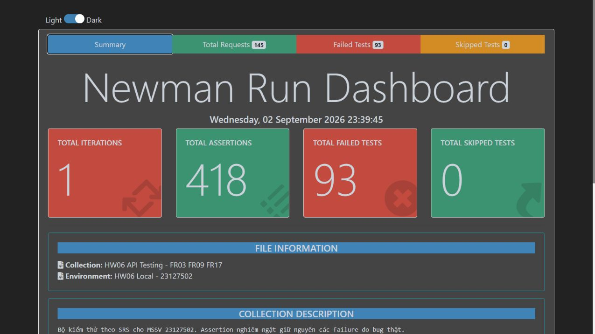

- **Danh sách GitHub Issues:** [MinhTri27343/HW06-Testing - Issues](https://github.com/MinhTri27343/HW06-Testing/issues)

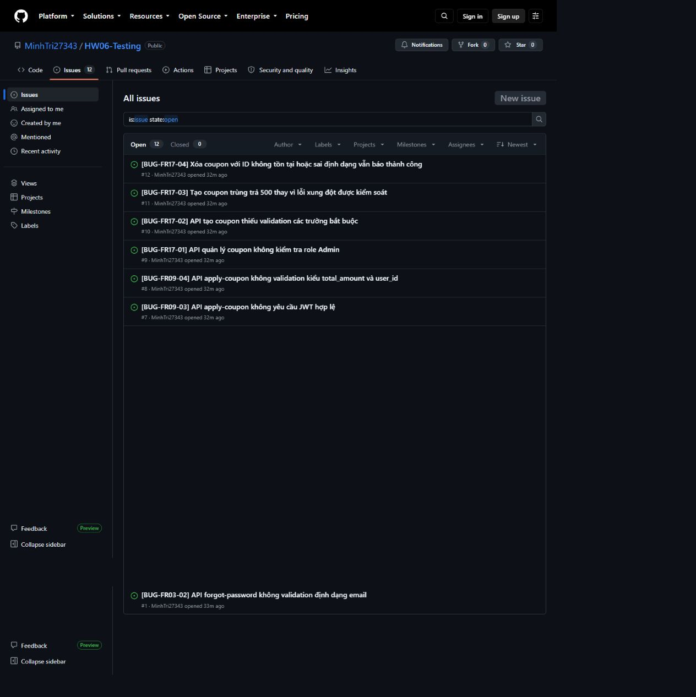

Có 12 nhóm lỗi được xác nhận từ execution evidence. Hai test case ngoài các nhóm dưới đây vẫn giữ trạng thái `REVIEW` và không được công bố là bug.

## Danh sách lỗi

| ID | FR | SEC | Severity | Tiêu đề | GitHub Issue |
|---|---|---|---|---|---|
| BUG-FR03-01 | FR-03 | SEC-07 | High | OTP đặt lại mật khẩu chỉ có 4 chữ số thay vì tối thiểu 6 | [#4](https://github.com/MinhTri27343/HW06-Testing/issues/4) |
| BUG-FR03-02 | FR-03 | SEC-05 | Medium | API forgot-password không validation định dạng email | [#1](https://github.com/MinhTri27343/HW06-Testing/issues/1) |
| BUG-FR03-03 | FR-03 | SEC-07 | High | API reset-password chấp nhận mật khẩu yếu hoặc null | [#2](https://github.com/MinhTri27343/HW06-Testing/issues/2) |
| BUG-FR03-04 | FR-03 | SEC-07 | High | Không giới hạn số lần thử OTP sai | [#3](https://github.com/MinhTri27343/HW06-Testing/issues/3) |
| BUG-FR09-01 | FR-09 | - | Critical | Công thức giảm giá phần trăm tính sai | [#5](https://github.com/MinhTri27343/HW06-Testing/issues/5) |
| BUG-FR09-02 | FR-09 | - | High | Coupon bị từ chối khi tổng tiền đúng bằng ngưỡng tối thiểu | [#6](https://github.com/MinhTri27343/HW06-Testing/issues/6) |
| BUG-FR09-03 | FR-09 | SEC-02 | Critical | API apply-coupon không yêu cầu JWT hợp lệ | [#7](https://github.com/MinhTri27343/HW06-Testing/issues/7) |
| BUG-FR09-04 | FR-09 | SEC-05 | High | API apply-coupon không validation kiểu total_amount và user_id | [#8](https://github.com/MinhTri27343/HW06-Testing/issues/8) |
| BUG-FR17-01 | FR-17 | SEC-02, SEC-03 | Critical | API quản lý coupon không kiểm tra role Admin | [#9](https://github.com/MinhTri27343/HW06-Testing/issues/9) |
| BUG-FR17-02 | FR-17 | SEC-05 | High | API tạo coupon thiếu validation các trường bắt buộc | [#10](https://github.com/MinhTri27343/HW06-Testing/issues/10) |
| BUG-FR17-03 | FR-17 | SEC-05 | Medium | Tạo coupon trùng trả 500 thay vì lỗi xung đột được kiểm soát | [#11](https://github.com/MinhTri27343/HW06-Testing/issues/11) |
| BUG-FR17-04 | FR-17 | SEC-05 | Medium | Xóa coupon với ID không tồn tại hoặc sai định dạng vẫn báo thành công | [#12](https://github.com/MinhTri27343/HW06-Testing/issues/12) |

## BUG-FR03-01 - OTP đặt lại mật khẩu chỉ có 4 chữ số thay vì tối thiểu 6

- **Feature / Security:** FR-03 / SEC-07
- **Severity:** High
- **Endpoint:** `POST /api/forgot-password`
- **Test case:** `FR-03-TC-001`, `FR-03-TC-002`, `FR-03-TC-013`
- **GitHub Issue:** [#4](https://github.com/MinhTri27343/HW06-Testing/issues/4)

### Bước tái hiện

1. Khởi động SUT từ database được reset và seed.
2. Chạy collection `postman/HW06.postman_collection.json` bằng Newman.
3. Mở test case được liệt kê và đối chiếu HTTP response với assertion.

### Kết quả mong đợi

Response trả OTP gồm đúng 6 chữ số.

### Kết quả thực tế

SUT trả OTP gồm 4 chữ số.

- **FR-03-TC-001:** HTTP 200; 1 assertion lỗi: expected '9381' to match /^\d{6}$/
- **FR-03-TC-002:** HTTP 200; 1 assertion lỗi: expected '2849' to match /^\d{6}$/
- **FR-03-TC-013:** HTTP 200; 1 assertion lỗi: expected '2084' to match /^\d{6}$/

### Bằng chứng Newman

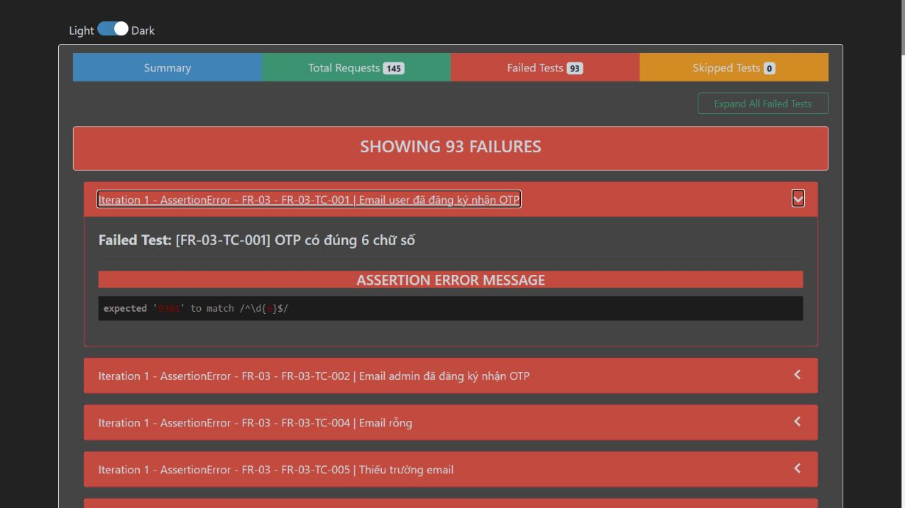

### Bằng chứng GitHub Issue

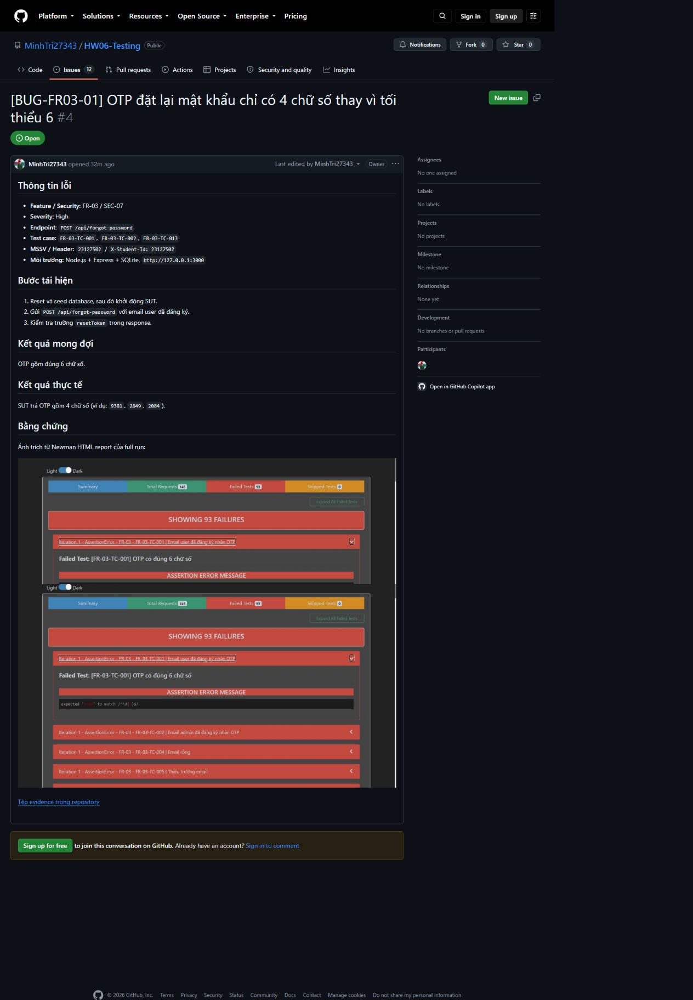

---

## BUG-FR03-02 - API forgot-password không validation định dạng email

- **Feature / Security:** FR-03 / SEC-05
- **Severity:** Medium
- **Endpoint:** `POST /api/forgot-password`
- **Test case:** `FR-03-TC-004`, `FR-03-TC-005`, `FR-03-TC-006`, `FR-03-TC-007`, `FR-03-TC-008`, `FR-03-TC-009`, `FR-03-TC-011`, `FR-03-TC-039`
- **GitHub Issue:** [#1](https://github.com/MinhTri27343/HW06-Testing/issues/1)

### Bước tái hiện

1. Khởi động SUT từ database được reset và seed.
2. Chạy collection `postman/HW06.postman_collection.json` bằng Newman.
3. Mở test case được liệt kê và đối chiếu HTTP response với assertion.

### Kết quả mong đợi

Email rỗng, null, sai định dạng hoặc sai kiểu bị từ chối bằng HTTP 400.

### Kết quả thực tế

SUT truy vấn trực tiếp và trả HTTP 404 thay vì lỗi validation 400.

- **FR-03-TC-004:** HTTP 404; 1 assertion lỗi: expected response to have status code 400 but got 404
- **FR-03-TC-005:** HTTP 404; 1 assertion lỗi: expected response to have status code 400 but got 404
- **FR-03-TC-006:** HTTP 404; 1 assertion lỗi: expected response to have status code 400 but got 404
- **FR-03-TC-007:** HTTP 404; 1 assertion lỗi: expected response to have status code 400 but got 404
- **FR-03-TC-008:** HTTP 404; 1 assertion lỗi: expected response to have status code 400 but got 404
- **FR-03-TC-009:** HTTP 404; 1 assertion lỗi: expected response to have status code 400 but got 404
- **FR-03-TC-011:** HTTP 404; 1 assertion lỗi: expected response to have status code 400 but got 404
- **FR-03-TC-039:** HTTP 404; 1 assertion lỗi: expected response to have status code 400 but got 404

### Bằng chứng Newman

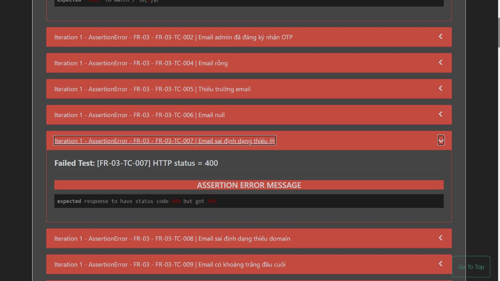

### Bằng chứng GitHub Issue

---

## BUG-FR03-03 - API reset-password chấp nhận mật khẩu yếu hoặc null

- **Feature / Security:** FR-03 / SEC-07
- **Severity:** High
- **Endpoint:** `POST /api/reset-password`
- **Test case:** `FR-03-TC-027`, `FR-03-TC-028`, `FR-03-TC-029`, `FR-03-TC-030`, `FR-03-TC-031`, `FR-03-TC-032`
- **GitHub Issue:** [#2](https://github.com/MinhTri27343/HW06-Testing/issues/2)

### Bước tái hiện

1. Khởi động SUT từ database được reset và seed.
2. Chạy collection `postman/HW06.postman_collection.json` bằng Newman.
3. Mở test case được liệt kê và đối chiếu HTTP response với assertion.

### Kết quả mong đợi

Mật khẩu mới không đạt chính sách độ mạnh phải bị từ chối bằng HTTP 400.

### Kết quả thực tế

SUT trả HTTP 200 và cập nhật mật khẩu yếu hoặc null.

- **FR-03-TC-027:** HTTP 200; 2 assertion lỗi: expected response to have status code 400 but got 200 | expected { Object (message) } to have property 'error'
- **FR-03-TC-028:** HTTP 200; 2 assertion lỗi: expected response to have status code 400 but got 200 | expected { Object (message) } to have property 'error'
- **FR-03-TC-029:** HTTP 200; 2 assertion lỗi: expected response to have status code 400 but got 200 | expected { Object (message) } to have property 'error'
- **FR-03-TC-030:** HTTP 200; 2 assertion lỗi: expected response to have status code 400 but got 200 | expected { Object (message) } to have property 'error'
- **FR-03-TC-031:** HTTP 200; 2 assertion lỗi: expected response to have status code 400 but got 200 | expected { Object (message) } to have property 'error'
- **FR-03-TC-032:** HTTP 200; 2 assertion lỗi: expected response to have status code 400 but got 200 | expected { Object (message) } to have property 'error'

### Bằng chứng Newman

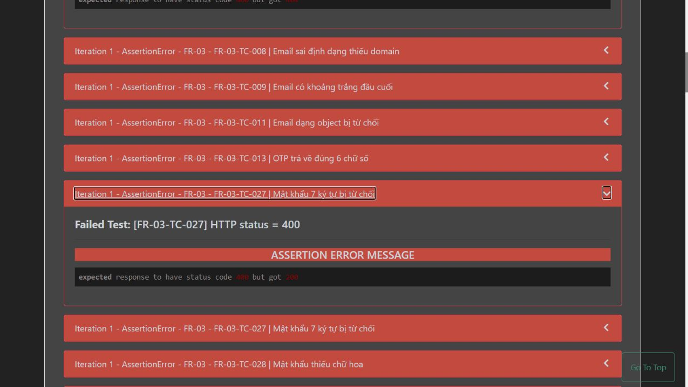

### Bằng chứng GitHub Issue

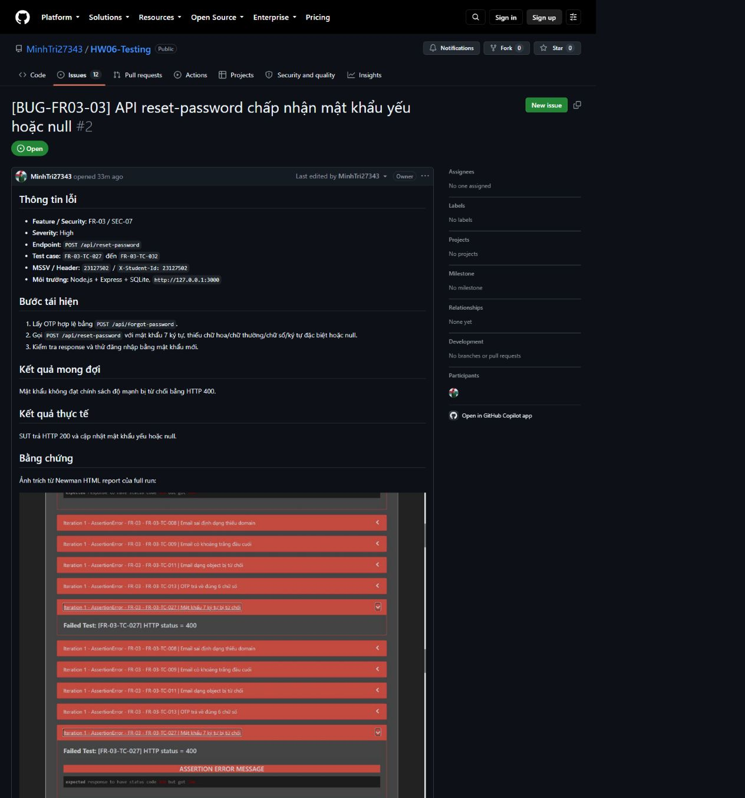

---

## BUG-FR03-04 - Không giới hạn số lần thử OTP sai

- **Feature / Security:** FR-03 / SEC-07
- **Severity:** High
- **Endpoint:** `POST /api/reset-password`
- **Test case:** `FR-03-TC-036`
- **GitHub Issue:** [#3](https://github.com/MinhTri27343/HW06-Testing/issues/3)

### Bước tái hiện

1. Khởi động SUT từ database được reset và seed.
2. Chạy collection `postman/HW06.postman_collection.json` bằng Newman.
3. Mở test case được liệt kê và đối chiếu HTTP response với assertion.

### Kết quả mong đợi

Nhiều lần thử OTP sai phải bị rate-limit bằng HTTP 429.

### Kết quả thực tế

SUT tiếp tục trả HTTP 400 và không khóa/rate-limit yêu cầu.

- **FR-03-TC-036:** HTTP 400; 1 assertion lỗi: expected response to have status code 429 but got 400

### Bằng chứng Newman

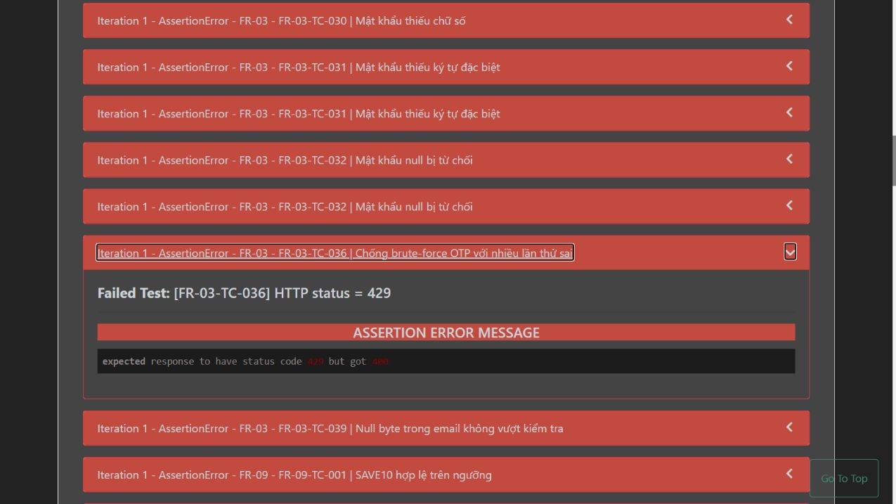

### Bằng chứng GitHub Issue

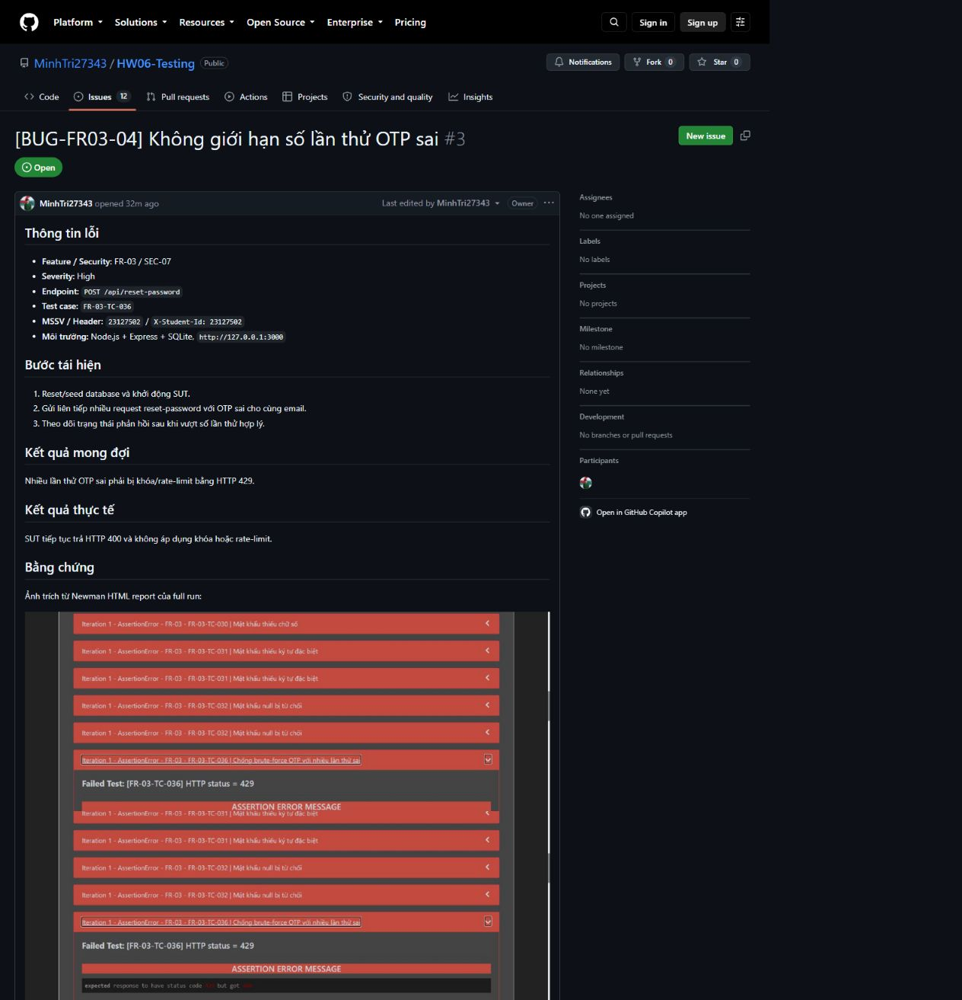

---

## BUG-FR09-01 - Công thức giảm giá phần trăm tính sai

- **Feature / Security:** FR-09 / -
- **Severity:** Critical
- **Endpoint:** `POST /api/apply-coupon`
- **Test case:** `FR-09-TC-001`, `FR-09-TC-013`
- **GitHub Issue:** [#5](https://github.com/MinhTri27343/HW06-Testing/issues/5)

### Bước tái hiện

1. Khởi động SUT từ database được reset và seed.
2. Chạy collection `postman/HW06.postman_collection.json` bằng Newman.
3. Mở test case được liệt kê và đối chiếu HTTP response với assertion.

### Kết quả mong đợi

Coupon phần trăm tính discount_amount = total_amount × discount_value / 100.

### Kết quả thực tế

SUT trả discount_amount âm và final_amount vượt tổng tiền ban đầu.

- **FR-09-TC-001:** HTTP 200; 1 assertion lỗi: expected -4500000 to deeply equal 50000
- **FR-09-TC-013:** HTTP 200; 1 assertion lỗi: expected -2700009 to deeply equal 30000

### Bằng chứng Newman

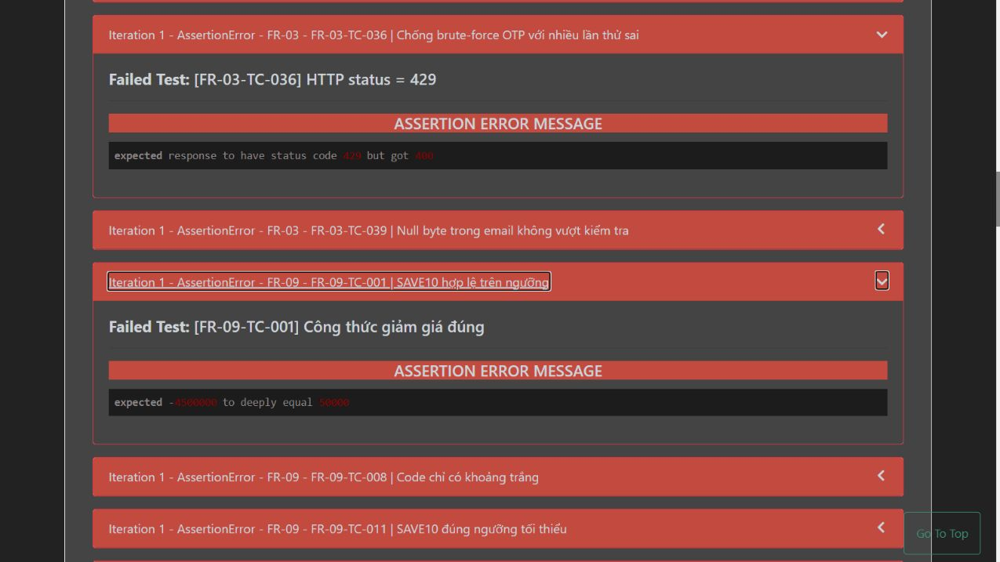

### Bằng chứng GitHub Issue

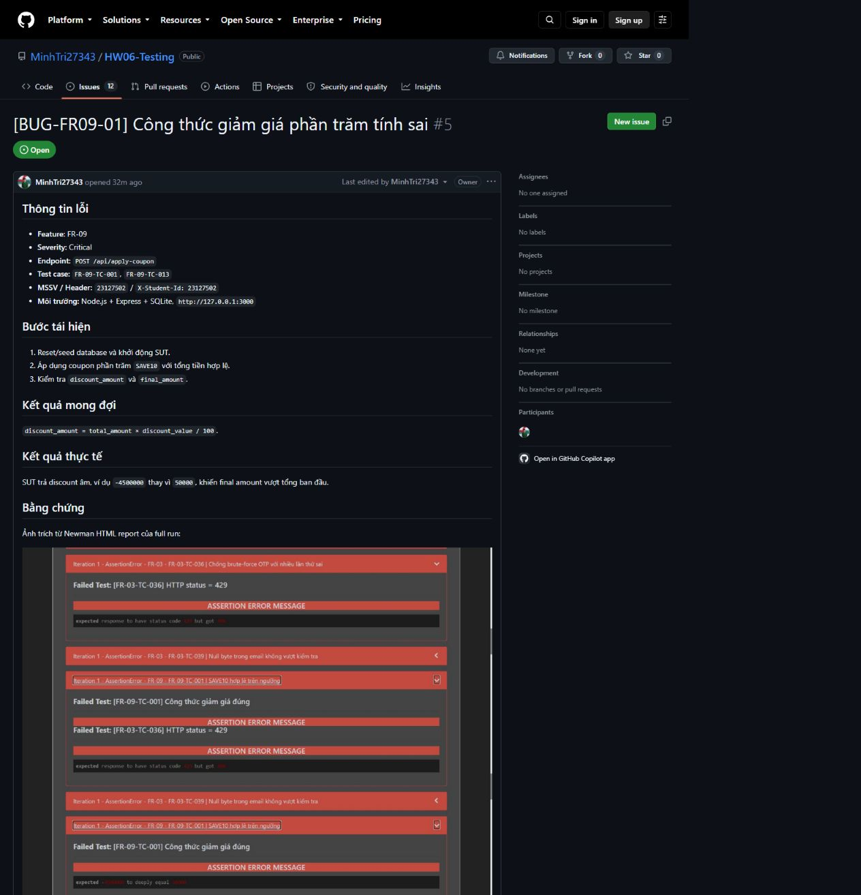

---

## BUG-FR09-02 - Coupon bị từ chối khi tổng tiền đúng bằng ngưỡng tối thiểu

- **Feature / Security:** FR-09 / -
- **Severity:** High
- **Endpoint:** `POST /api/apply-coupon`
- **Test case:** `FR-09-TC-011`, `FR-09-TC-014`
- **GitHub Issue:** [#6](https://github.com/MinhTri27343/HW06-Testing/issues/6)

### Bước tái hiện

1. Khởi động SUT từ database được reset và seed.
2. Chạy collection `postman/HW06.postman_collection.json` bằng Newman.
3. Mở test case được liệt kê và đối chiếu HTTP response với assertion.

### Kết quả mong đợi

total_amount bằng min_order_amount vẫn đủ điều kiện áp dụng coupon.

### Kết quả thực tế

SUT trả HTTP 400 tại đúng giá trị biên tối thiểu.

- **FR-09-TC-011:** HTTP 400; 5 assertion lỗi: expected response to have status code 200 but got 400 | expected { Object (error) } to have property 'success' | expected { Object (error) } to have property 'discount_amount' | expected { Object (error) } to have property 'final_amount' | expected undefined to deeply equal 30000
- **FR-09-TC-014:** HTTP 400; 5 assertion lỗi: expected response to have status code 200 but got 400 | expected { Object (error) } to have property 'success' | expected { Object (error) } to have property 'discount_amount' | expected { Object (error) } to have property 'final_amount' | expected undefined to deeply equal 50000

### Bằng chứng Newman

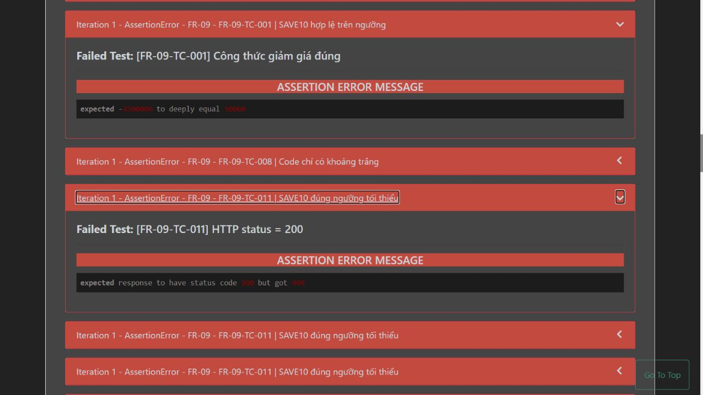

### Bằng chứng GitHub Issue

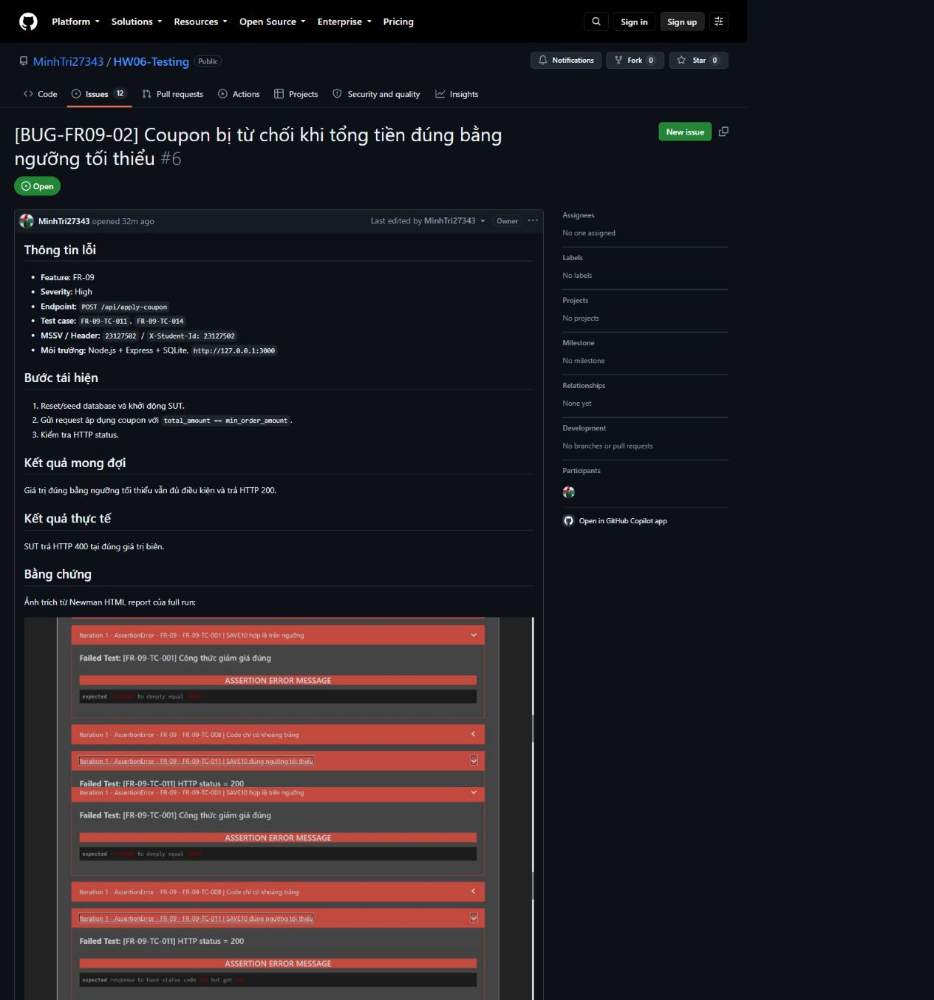

---

## BUG-FR09-03 - API apply-coupon không yêu cầu JWT hợp lệ

- **Feature / Security:** FR-09 / SEC-02
- **Severity:** Critical
- **Endpoint:** `POST /api/apply-coupon`
- **Test case:** `FR-09-TC-023`, `FR-09-TC-024`
- **GitHub Issue:** [#7](https://github.com/MinhTri27343/HW06-Testing/issues/7)

### Bước tái hiện

1. Khởi động SUT từ database được reset và seed.
2. Chạy collection `postman/HW06.postman_collection.json` bằng Newman.
3. Mở test case được liệt kê và đối chiếu HTTP response với assertion.

### Kết quả mong đợi

Request thiếu JWT hoặc dùng JWT sai phải bị từ chối bằng HTTP 401.

### Kết quả thực tế

SUT vẫn xử lý coupon và trả HTTP 200.

- **FR-09-TC-023:** HTTP 200; 2 assertion lỗi: expected response to have status code 401 but got 200 | expected { success: true, coupon_id: 1, …(3) } to have property 'error'
- **FR-09-TC-024:** HTTP 200; 2 assertion lỗi: expected response to have status code 403 but got 200 | expected { success: true, coupon_id: 1, …(3) } to have property 'error'

### Bằng chứng Newman

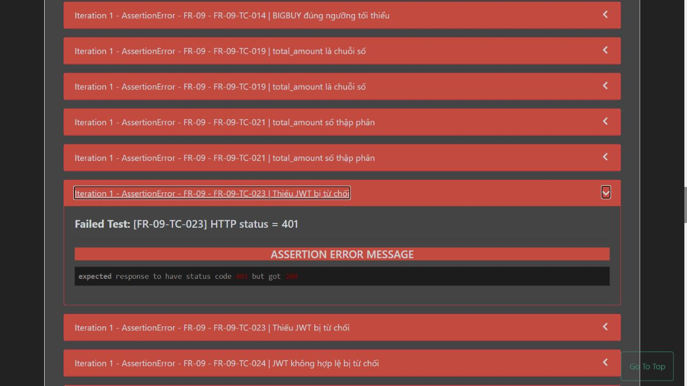

### Bằng chứng GitHub Issue

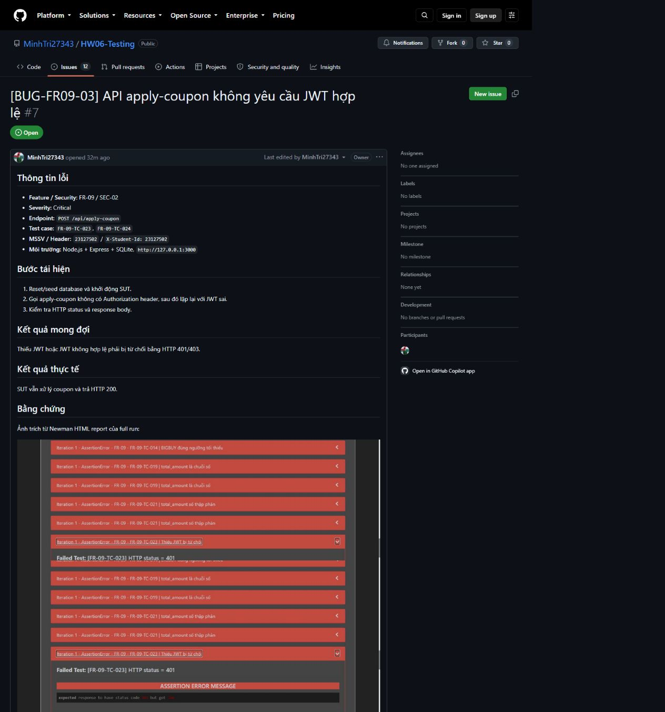

---

## BUG-FR09-04 - API apply-coupon không validation kiểu total_amount và user_id

- **Feature / Security:** FR-09 / SEC-05
- **Severity:** High
- **Endpoint:** `POST /api/apply-coupon`
- **Test case:** `FR-09-TC-019`, `FR-09-TC-021`, `FR-09-TC-028`, `FR-09-TC-029`
- **GitHub Issue:** [#8](https://github.com/MinhTri27343/HW06-Testing/issues/8)

### Bước tái hiện

1. Khởi động SUT từ database được reset và seed.
2. Chạy collection `postman/HW06.postman_collection.json` bằng Newman.
3. Mở test case được liệt kê và đối chiếu HTTP response với assertion.

### Kết quả mong đợi

total_amount và user_id sai kiểu hoặc không tồn tại phải bị từ chối bằng HTTP 400/404.

### Kết quả thực tế

SUT ép kiểu hoặc tiếp tục xử lý và trả HTTP 200.

- **FR-09-TC-019:** HTTP 200; 2 assertion lỗi: expected response to have status code 400 but got 200 | expected { success: true, coupon_id: 1, …(3) } to have property 'error'
- **FR-09-TC-021:** HTTP 200; 2 assertion lỗi: expected response to have status code 400 but got 200 | expected { success: true, coupon_id: 1, …(3) } to have property 'error'
- **FR-09-TC-028:** HTTP 200; 2 assertion lỗi: expected response to have status code 400 but got 200 | expected { success: true, coupon_id: 2, …(3) } to have property 'error'
- **FR-09-TC-029:** HTTP 200; 2 assertion lỗi: expected response to have status code 400 but got 200 | expected { success: true, coupon_id: 2, …(3) } to have property 'error'

### Bằng chứng Newman

### Bằng chứng GitHub Issue

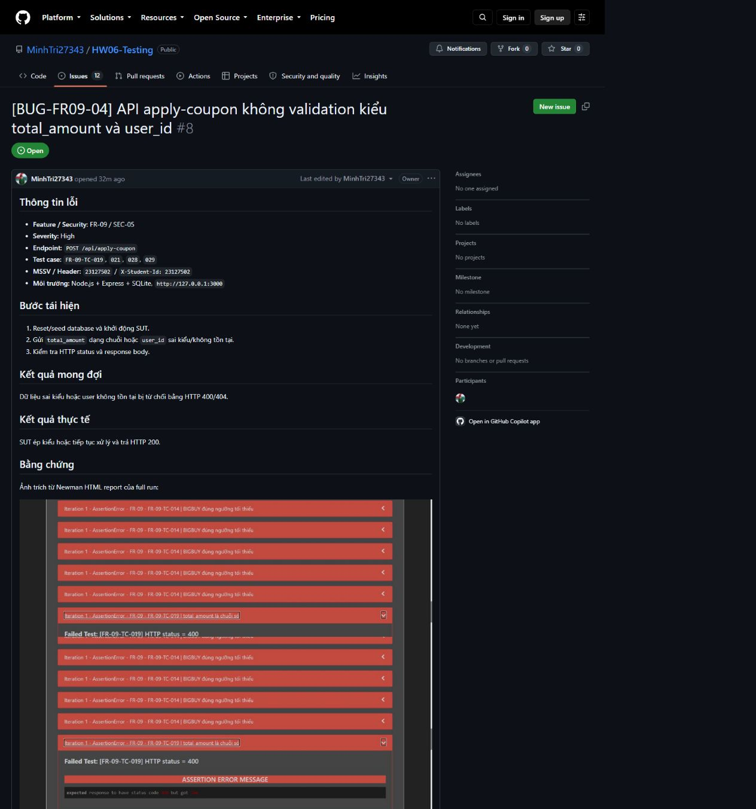

---

## BUG-FR17-01 - API quản lý coupon không kiểm tra role Admin

- **Feature / Security:** FR-17 / SEC-02, SEC-03
- **Severity:** Critical
- **Endpoint:** `GET/POST/DELETE /api/coupons`
- **Test case:** `FR-17-TC-002`, `FR-17-TC-008`, `FR-17-TC-031`, `FR-17-TC-036`
- **GitHub Issue:** [#9](https://github.com/MinhTri27343/HW06-Testing/issues/9)

### Bước tái hiện

1. Khởi động SUT từ database được reset và seed.
2. Chạy collection `postman/HW06.postman_collection.json` bằng Newman.
3. Mở test case được liệt kê và đối chiếu HTTP response với assertion.

### Kết quả mong đợi

JWT của user thường phải bị từ chối bằng HTTP 403 tại endpoint quản trị.

### Kết quả thực tế

User thường có thể xem, tạo và xóa coupon với HTTP 200.

- **FR-17-TC-002:** HTTP 200; 2 assertion lỗi: expected response to have status code 403 but got 200 | expected [ …(4) ] to have property 'error'
- **FR-17-TC-008:** HTTP 200; 2 assertion lỗi: expected response to have status code 403 but got 200 | expected { message: 'Coupon created', id: 7 } to have property 'error'
- **FR-17-TC-031:** HTTP 200; 2 assertion lỗi: expected response to have status code 403 but got 200 | expected { message: 'Coupon deleted' } to have property 'error'
- **FR-17-TC-036:** HTTP 200; 2 assertion lỗi: expected response to have status code 403 but got 200 | expected { message: 'Coupon created', id: 29 } to have property 'error'

### Bằng chứng Newman

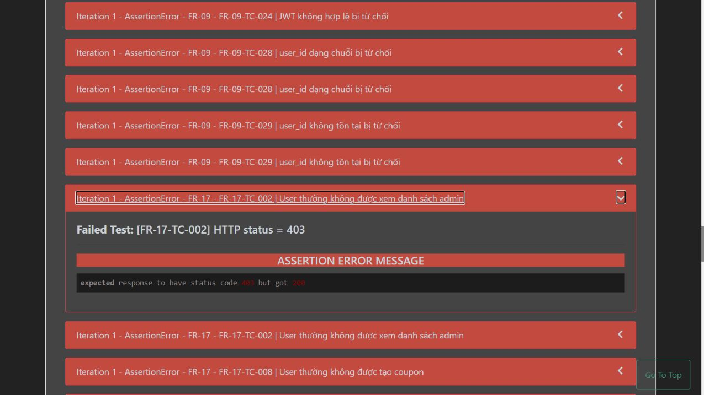

### Bằng chứng GitHub Issue

---

## BUG-FR17-02 - API tạo coupon thiếu validation các trường bắt buộc

- **Feature / Security:** FR-17 / SEC-05
- **Severity:** High
- **Endpoint:** `POST /api/admin/coupons`
- **Test case:** `FR-17-TC-011`, `FR-17-TC-012`, `FR-17-TC-013`, `FR-17-TC-015`, `FR-17-TC-016`, `FR-17-TC-017`, `FR-17-TC-018`, `FR-17-TC-019`, `FR-17-TC-020`, `FR-17-TC-022`, `FR-17-TC-023`, `FR-17-TC-024`, `FR-17-TC-026`, `FR-17-TC-027`
- **GitHub Issue:** [#10](https://github.com/MinhTri27343/HW06-Testing/issues/10)

### Bước tái hiện

1. Khởi động SUT từ database được reset và seed.
2. Chạy collection `postman/HW06.postman_collection.json` bằng Newman.
3. Mở test case được liệt kê và đối chiếu HTTP response với assertion.

### Kết quả mong đợi

Payload thiếu/sai kiểu, giá trị âm hoặc ngoài miền phải bị từ chối bằng HTTP 400.

### Kết quả thực tế

SUT vẫn tạo coupon và trả HTTP 200 cho nhiều payload không hợp lệ.

- **FR-17-TC-011:** HTTP 200; 2 assertion lỗi: expected response to have status code 400 but got 200 | expected { message: 'Coupon created', id: 8 } to have property 'error'
- **FR-17-TC-012:** HTTP 200; 2 assertion lỗi: expected response to have status code 400 but got 200 | expected { message: 'Coupon created', id: 9 } to have property 'error'
- **FR-17-TC-013:** HTTP 200; 2 assertion lỗi: expected response to have status code 400 but got 200 | expected { message: 'Coupon created', id: 10 } to have property 'error'
- **FR-17-TC-015:** HTTP 200; 2 assertion lỗi: expected response to have status code 400 but got 200 | expected { message: 'Coupon created', id: 12 } to have property 'error'
- **FR-17-TC-016:** HTTP 200; 2 assertion lỗi: expected response to have status code 400 but got 200 | expected { message: 'Coupon created', id: 13 } to have property 'error'
- **FR-17-TC-017:** HTTP 200; 2 assertion lỗi: expected response to have status code 400 but got 200 | expected { message: 'Coupon created', id: 14 } to have property 'error'
- **FR-17-TC-018:** HTTP 200; 2 assertion lỗi: expected response to have status code 400 but got 200 | expected { message: 'Coupon created', id: 15 } to have property 'error'
- **FR-17-TC-019:** HTTP 200; 2 assertion lỗi: expected response to have status code 400 but got 200 | expected { message: 'Coupon created', id: 16 } to have property 'error'
- **FR-17-TC-020:** HTTP 200; 2 assertion lỗi: expected response to have status code 400 but got 200 | expected { message: 'Coupon created', id: 17 } to have property 'error'
- **FR-17-TC-022:** HTTP 200; 2 assertion lỗi: expected response to have status code 400 but got 200 | expected { message: 'Coupon created', id: 19 } to have property 'error'
- **FR-17-TC-023:** HTTP 200; 2 assertion lỗi: expected response to have status code 400 but got 200 | expected { message: 'Coupon created', id: 20 } to have property 'error'
- **FR-17-TC-024:** HTTP 200; 2 assertion lỗi: expected response to have status code 400 but got 200 | expected { message: 'Coupon created', id: 21 } to have property 'error'
- **FR-17-TC-026:** HTTP 200; 2 assertion lỗi: expected response to have status code 400 but got 200 | expected { message: 'Coupon created', id: 23 } to have property 'error'
- **FR-17-TC-027:** HTTP 200; 2 assertion lỗi: expected response to have status code 400 but got 200 | expected { message: 'Coupon created', id: 24 } to have property 'error'

### Bằng chứng Newman

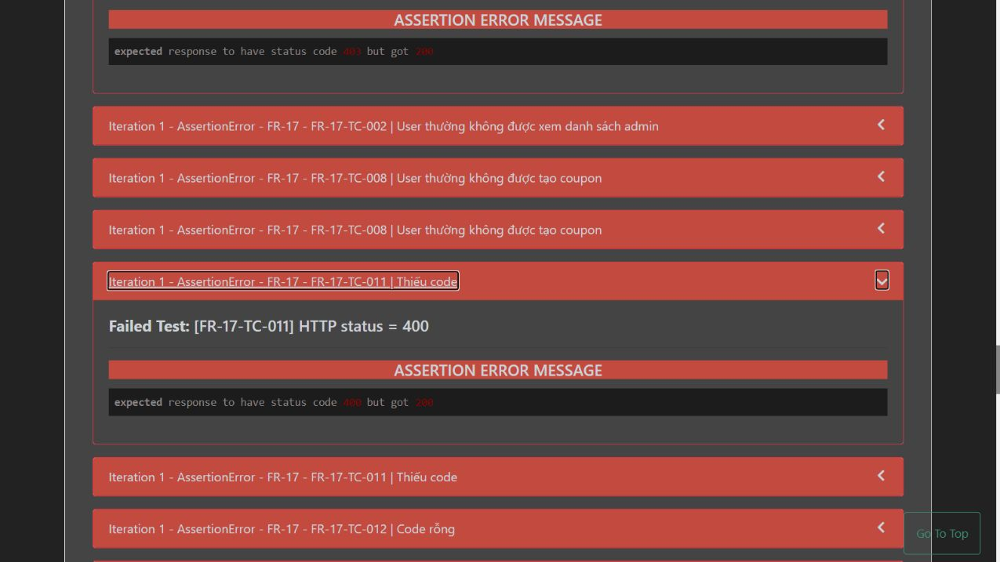

### Bằng chứng GitHub Issue

---

## BUG-FR17-03 - Tạo coupon trùng trả 500 thay vì lỗi xung đột được kiểm soát

- **Feature / Security:** FR-17 / SEC-05
- **Severity:** Medium
- **Endpoint:** `POST /api/admin/coupons`
- **Test case:** `FR-17-TC-014`, `FR-17-TC-037`
- **GitHub Issue:** [#11](https://github.com/MinhTri27343/HW06-Testing/issues/11)

### Bước tái hiện

1. Khởi động SUT từ database được reset và seed.
2. Chạy collection `postman/HW06.postman_collection.json` bằng Newman.
3. Mở test case được liệt kê và đối chiếu HTTP response với assertion.

### Kết quả mong đợi

Code trùng phải trả HTTP 409 với error schema được kiểm soát.

### Kết quả thực tế

SUT để lỗi SQLite thoát ra thành HTTP 500 hoặc xử lý không nhất quán.

- **FR-17-TC-014:** HTTP 500; 1 assertion lỗi: expected response to have status code 409 but got 500
- **FR-17-TC-037:** HTTP 500; 1 assertion lỗi: expected response to have status code 409 but got 500

### Bằng chứng Newman

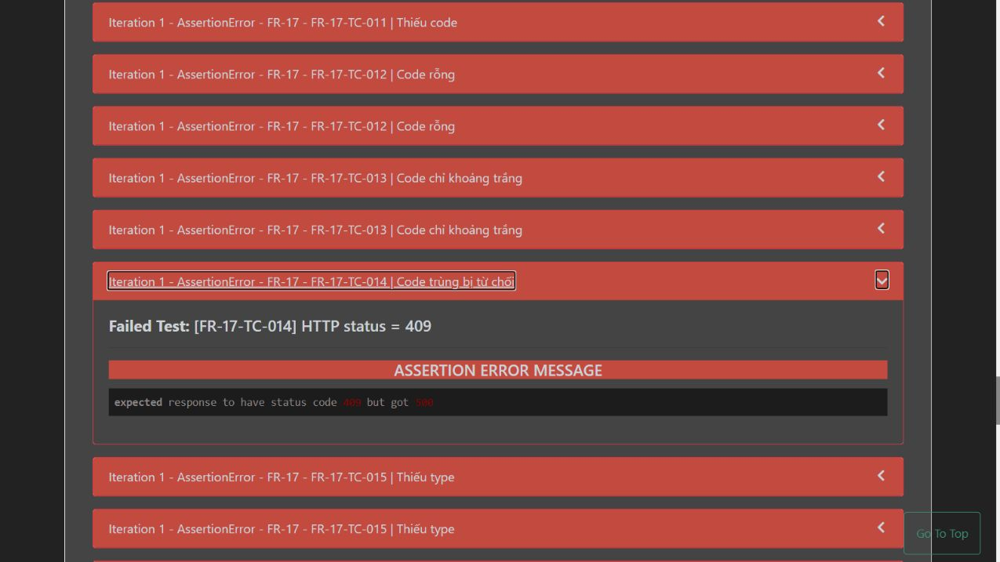

### Bằng chứng GitHub Issue

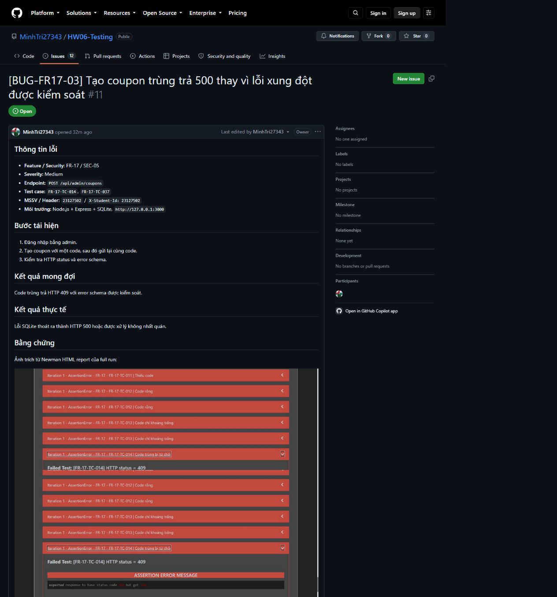

---

## BUG-FR17-04 - Xóa coupon với ID không tồn tại hoặc sai định dạng vẫn báo thành công

- **Feature / Security:** FR-17 / SEC-05
- **Severity:** Medium
- **Endpoint:** `DELETE /api/admin/coupons/:id`
- **Test case:** `FR-17-TC-034`, `FR-17-TC-035`
- **GitHub Issue:** [#12](https://github.com/MinhTri27343/HW06-Testing/issues/12)

### Bước tái hiện

1. Khởi động SUT từ database được reset và seed.
2. Chạy collection `postman/HW06.postman_collection.json` bằng Newman.
3. Mở test case được liệt kê và đối chiếu HTTP response với assertion.

### Kết quả mong đợi

ID không tồn tại trả HTTP 404; ID sai định dạng trả HTTP 400.

### Kết quả thực tế

SUT trả HTTP 200 và thông báo xóa thành công.

- **FR-17-TC-034:** HTTP 200; 2 assertion lỗi: expected response to have status code 404 but got 200 | expected { message: 'Coupon deleted' } to have property 'error'
- **FR-17-TC-035:** HTTP 200; 2 assertion lỗi: expected response to have status code 400 but got 200 | expected { message: 'Coupon deleted' } to have property 'error'

### Bằng chứng Newman

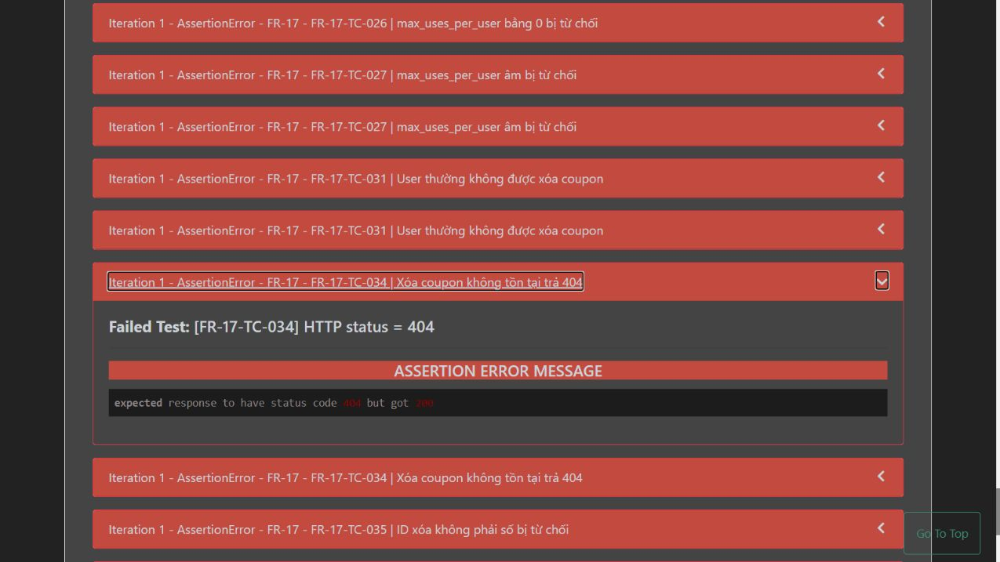

### Bằng chứng GitHub Issue

